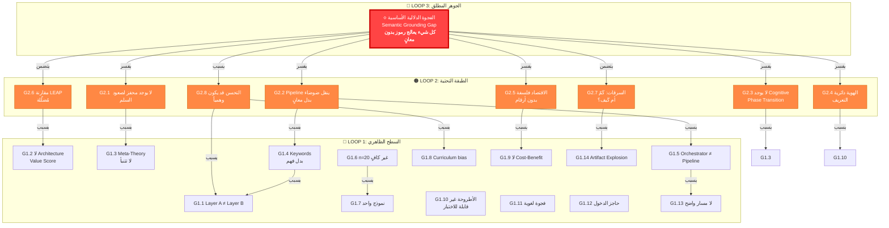

# 🥷 تقرير النينجا الحفّار — تحليل فجوات مشروع GENESIS
## Ninja Excavator Gap Analysis Report

**التاريخ:** 2026-06-06  
**المُحلّل:** النينجا الحفّار (Ninja Excavator Agent)  
**المشروع:** GENESIS — Tiered Externalized Recursive Intelligence  
**المستودع:** github.com/faresrafat3/GENESIS  
**نسخة الورقة:** v0.7 (PAPER.md)  
**الجلسات المُحلّلة:** 1–13.7  

---

> **"الذكاء ليس مجرد القدرة على إنتاج الجواب، بل القدرة على تنظيم الخبرة والمعرفة والموارد والاختبارات والذات عبر الزمن."**  
> — GENESIS Meta-Theory §3

---

## ╔══════════════════════════════════════════════════╗
## ║  PART 0: التهيئة — فهم المشروع من الداخل      ║
## ╚══════════════════════════════════════════════════╝

### 0.1 ما هو GENESIS فعلاً؟

GENESIS ليس مجرد "framework" للوكلاء. هو **محاولة جذرية لإعادة تعريف الذكاء الاصطناعي** خارج النموذج السائد (scaling = intelligence). المشروع يطرح سؤالاً وجودياً:

> هل يمكن بناء ذكاء agentic متنامي فوق LLM APIs عبر منظومة من artefacts معرفية وحوكمة وذاكرة واختبارات وهوية، **دون أن تكون الأوزان هي المسرح الوحيد أو الأساسي لنمو الذكاء**؟

### 0.2 البنية ثلاثية الأبعاد للمشروع

| البُعد | المكون | الحالة |
|--------|--------|--------|
| **البنية التجريبية** | gpt-oss-120b على GPQA Diamond | Baseline 75% ≠ GENESIS 65% (فجوة −10) |
| **البنية النظرية** | 4 نظريات + 1 فلسفة + 8 أركان + 10 قوانين ميتا | غنية لكن غير مُختبرة تجريبياً بعد |
| **البنية التشغيلية** | 122 وثيقة عربية + 463 اختبار + 13.7 جلسة | ضخمة جداً — خطر التيه التوثيقي |

### 0.3 الفرضيات الأساسية المستنتجة

| # | الفرضية | المصدر |
|---|---------|--------|
| H1 | تكوين المفاهيم يتفوق على الاسترجاع فقط | Layer A results (98.6% vs 79.2%) |
| H2 | الاقتصاد الإدراكي يتفوق على التوسع بالنموذج الأقوى | Layer A ablation (4.3× cost reduction) |
| H3 | الذكاء = تنظيم خارجي متدرج (Tiered Externalized) | Meta-Theory §1 |
| H4 | النسيان مُكوِّن وليس مجرد مُصحِّح | Productive Forgetting Theory |
| H5 | التناقضات ضرورية للنمو | Meta-Law 3 |
| H6 | LEAP تثبت أن البنية المعمارية يمكن أن تضيف +100 نقطة | Paper §8.5 contrast |
| H7 | فجوة GENESIS الـ 10 نقاط سببها تصميمي وليس قدري | Theory-07/08/09 diagnosis |

---

## ╔══════════════════════════════════════════════════╗
## ║  LOOP 1: السطح الظاهري — الفجوات الأولية     ║
## ╚══════════════════════════════════════════════════╝

> **سؤال الحلقة:** ما الذي يبدو خاطئاً أو ناقصاً للمراقب المتعمق؟

### 🔵 فجوات مفهومية (Conceptual Gaps)

#### G1.1 — التناقض بين نتائج Layer A و Layer B
- **Layer A** يدّعي 98.6% على curriculum مصطنع
- **Layer B** يسجّل 65% على GPQA-20 (أقل من baseline)
- **الفجوة:** لا يوجد جسر نظري يفسّر لماذا النجاح على المهام المصطنعة لا ينتقل للمهام الحقيقية
- **التصنيف:** مفهومية — خطيرة

#### G1.2 — غياب تعريف تشغيلي لـ "قيمة العمارة"
- الورقة تعرف Official → Pure → Orchestrated
- لكنها لا تملك مقياساً مستمراً لـ "Architecture Value Score"
- الفرق بين 65% و 75% يُقرأ كفشل، لكن هل 74.9% هو نجاح؟ أين العتبة؟
- **التصنيف:** مفهومية — تقييمية

#### G1.3 — الـ Meta-Theory لا تتنبأ بنتائج قابلة للدحض بشكل مباشر
- 10 قوانين ميتا هي توجيهات فلسفية جميلة
- لكن لا يوجد Prediction: "إذا تحقق X في النظام، فإن Y يجب أن يحدث"
- Meta-Laws تصف كيف *ينبغي* أن يكون النظام، لا ما *سيحدث* فعلاً
- **التصنيف:** مفهومية — نظرية

### 🟠 فجوات تقنية (Technical Gaps)

#### G1.4 — الـ Cognitive Pipeline يعمل على الكلمات المفتاحية
- المشروع يعترف بذلك صراحة: "currently keyword + template driven"
- Concept Engine يستخدم hardcoded selectivity
- Verification = keyword presence checks
- النتيجة: النظام يحاكي الذكاء على Level 2-3 (Pattern → Heuristic) لكنه لا يعيش فعلاً في Level 4-5
- **التصنيف:** تقنية — حرجة

#### G1.5 — انفصال كامل بين Orchestrator و Cognitive Pipeline
- المشروع يصرّح بهذا: "انقطاع كامل بين Orchestrator و GENESIS"
- Phase 1 من الخطة الاستراتيجية هو بناء هذا الجسر
- لكن بدون هذا الجسر، GENESIS هو نوعان مختلفان من الأنظمة غير المتصلة
- **التصنيف:** تقنية — بنية تحتية

#### G1.6 — حجم العيّنة (n=20) لا يكفي لأي ادعاء إحصائي
- ±10% margin of error على 20 سؤال
- أي ادعاء بـ +5 أو −5 نقاط قد يكون ضوضاء
- الفرق بين 65% و 70% (run_58) قد لا يكون ذا دلالة إحصائية
- **التصنيف:** تقنية — إحصائية

#### G1.7 — الاستعداد على نموذج واحد فقط (gpt-oss-120b)
- كل النتائج على نموذج واحد عبر tier مجاني واحد
- لا يمكن استنتاج أي شيء عن Generalizability
- **التصنيف:** تقنية — تجريبية

### 🟡 فجوات تقييمية (Evaluation Gaps)

#### G1.8 — الـ 98.6% على curriculum مصطنع قد يكون مُضلّلاً
- prototype_v3b_curriculum = 72 مهمة مصممة يدوياً
- النجاح قد يعكس ملاءمة النظام لهذه المهام بالذات (overfitting)
- لا يوجد curriculum متنوع أو معياري قابل للمقارنة
- **التصنيف:** تقييمية — منهجية

#### G1.9 — غياب معيار تكلفة-فائدة حقيقي
- Layer A يذكر "4.3× cost reduction" لكنه على tasks مصطنعة
- Layer B لا يقدم تحليل تكلفة-فائدة على GPQA
- السؤال: هل 10 نقاط إضافية (لو تحققت) تستحق كلفة البنية التحتية الكاملة؟
- **التصنيف:** تقييمية — اقتصادية

#### G1.10 — الأطروحة الأقوى (الت externally organized intelligence) غير قابلة للاختبار بهيكلها الحالي
- "الذكاء هو Epistemic self-organization under bounded resources"
- كيف نقيس "self-organization"؟ كيف نقيس "epistemic" vs "non-epistemic"؟
- **التصنيف:** تقييمية — نظرية

### 🟢 فجوات توصيلية (Communication Gaps)

#### G1.11 — الفجوة اللغوية: 122 وثيقة عربية vs الورقة الإنجليزية
- النظرية الأساسية مكتوبة بالعربية
- الورقة الموجهة للنشر بالإنجليزية
- خطر فقدان الدلالات في الترجمة (خاصة مفاهيم مثل "السرقات الشرعية")
- **التصنيف:** توصيلية — نشر

#### G1.12 — كثافة التوثيق قد تخنق أي مساهم خارجي
- AGENT_OPERATING_MANUAL وحده 700 سطر
- PROJECT_README يطلب من أي وكيل جديد قراءة 5 وثائق رئيسية
- الحاجز للدخول مرتفع جداً
- **التصنيف:** توصيلية — قابلية التوسع

### 🔴 فجوات مستقبلية (Future Gaps)

#### G1.13 — لا يوجد مسار واضح من "−10 نقاط" إلى "أفضل من baseline"
- Tracks A.1-A.5 نظريّة بالكامل
- لا يوجد نموذج رياضي يتنبأ بكم ستضيف كل تدخّل
- "نأمل أن نتحسن" ليس خطة هندسية
- **التصنيف:** مستقبلية — استراتيجية

#### G1.14 — خطر الـ Artifact Explosion (Threat B من Meta-Theory)
- النظام يولّد concepts, theories, skills, anomalies, contradictions, benchmarks
- لا يوجد حد أعلى لعدد artefacts
- Productive Forgetting Theory موجودة نظرياً لكنها غير مُنفّذة في الكود
- **التصنيف:** مستقبلية — معمارية

---

## ╔══════════════════════════════════════════════════╗
## ║  LOOP 2: الطبقة التحتية — ما لم يُسأل بعد    ║
## ╚══════════════════════════════════════════════════╝

> **سؤال الحلقة:** ما الافتراضات الدفينة التي تقف وراء كل ما سبق؟ ما الذي لم يُسأل بعد؟

### 🔥 G2.1 — فجوة الرافعة الأساسية: النظام لا يعرف متى يصعد السلم

**هذه الفجوة مركزية.** GENESIS يعرّف سلم التجريد (Ladder of Abstraction) بـ 7 مستويات:
```
Level 0: Observation
Level 1: Episode
Level 2: Pattern
Level 3: Heuristic
Level 4: Concept (named, scoped)
Level 5: Invariant
Level 6: Theory
```

لكن **لا توجد آلية لتحديد المستوى الحالي** أو **لقرار الصعود**. الأسئلة التي لم تُسأل:
- كيف يعرف النظام أنه في Level 2 ويحتاج لـ Level 4؟
- ما هو مُحفّز الصعود؟ هل هو عدد التكرارات؟ حجم التناقض؟ فشل التنبؤ؟
- هل الصعود يجب أن يكون تدريجياً (2→3→4) أم يمكن أن يكون قفزة (2→5)؟
- ماذا يحدث لو صعد النظام مبكراً؟ (over-abstraction)
- ماذا يحدث لو تأخر في الصعود؟ (under-abstraction)

**الافتراض الدفين:** النظام يفترض أن الصعود يحدث "طبيعياً" عبر Concept Engine. لكن Concept Engine الحالي يعمل بالكلمات المفتاحية — أي أنه لا يصعد فعلاً أبداً.

---

### 🔥 G2.2 — فجوة "الحزام": الـ Pipeline كحزام ناقل للضوضاء

الورقة تتعامل مع الـ pipeline كأنه اختيار بين Memory (Pull) و Decision Injection (Push). لكن هناك سؤال أعمق لم يُسأل:

**ماذا لو كان الـ pipeline نفسه هو مشكلة "النقل" وليس "النوع"؟**

LEAP ينجح ليس فقط لأنه Pull-based، بل لأن **مخرجاته قابلة للتحقق آلياً** (Lean compiler). في GENESIS، لا يوجد equivalent لهذا المُحقّق:
- المفاهيم → من يتحقق أنها صحيحة؟
- النظريات → من يتحقق أنها تنطبق؟
- التنبؤات → من يتحقق أنها مفيدة؟

**الافتراض الدفين:** GENESIS يفترض أن التحقق من Artefacts المعرفية يمكن أن يتم بـ LLM-as-judge. لكن Theory-08 تقول بالضبط إن هذا هو المربع الأسوأ (bottom-right quadrant).

---

### 🔥 G2.3 — فجوة الانتقال بين المستويات: لا يوجد "Cognitive Phase Transition"

الفيزياء تعلّمنا أن الانتقال بين أطوار المادة (صلب ← سائل ← غاز) يحدث عند نقاط حرجة محددة. بالمثل، GENESIS يفترض 7 مراحل نضج (Stage 0-6 في Meta-Theory §13)، لكن:

- **لا توجد نقاط حرجة مُعرّفة:** متى ينتقل النظام من Stage 2 (Proceduralization) إلى Stage 3 (Conceptualization)؟
- **لا توجد حرارة كامنة:** ما الذي "يُخزّن" من المرحلة السابقة عند الانتقال؟
- **لا يوجد قياس للنظام:** لا يوجد entropy أو free energy مُعرّفة على Epistemic Artifacts
- **لا يوجد irreversible transition:** هل يمكن للنظام أن يتراجع من Stage 4 إلى Stage 2؟

**الافتراض الدفين:** النضج المعرفي خطي وتدريجي. لكن كل ما نعرفه عن النمو المعرفي البشري (Piaget, Kuhn) يقول إن الانتقالات تكون **discontinuous** وغالباً **مُسبّبة بأزمات**.

---

### 🔥 G2.4 — فجوة "الهوية" بدون مُعرّف: Identity ≠ Continuity

GENESIS Identity Theory (§7.8 من Meta-Theory) تعرّف الهوية كـ:
> "قدرة على التحسن مع الحفاظ على continuity of commitments, memory governance, and accountability"

لكن هذا التعريف **دائري**: كيف تعرف أنك تحسنت إذا لم تكن لديك هوية؟ وكيف تحافظ على هوية إذا كنت تتغير؟

الأسئلة التي لم تُسأل:
- ما هو **الحد الأدنى** من المكونات التي يجب أن تبقى ثابتة لاعتبار النظام "نفس النظام"؟
- هل الهوية = النواة الثابتة أم = الالتزام بالقواعد؟ (انظر: Ship of Theseus)
- إذا أضاف النظام Theory جديدة تغيّر سلوكه جذرياً، هل هو "نفس" النظام؟
- **هل يمكن قياس "درجة الهوية" رقمياً؟**

**الافتراض الدفين:** الهوية تحفظها "governance rules". لكن governance rules نفسها يمكن أن تتغير (Paradigm Fork). إذا تغيرت القواعد، من يحفظ هوية القواعد؟

---

### 🔥 G2.5 — فجوة الاقتصاد الإدراكي: غياب "السعر" الفعلي

Cognitive Economy Theory تُعرّف 7 دوال قيمة (VoC, VoI, VoV, VoA, VoR, VoE, VoCollaboration). لكن:

- **لا واحدة منها مُطبّقة في الكود** كحساب فعلي
- الـ Tier Router يستخدم expected value calculation لكنه **keyword-based**
- لا يوجد تتبع فعلي لـ "كم استثمرنا من cognition وماذا حصلنا"
- المعادلة الكبرى (§12): `Expected Cognitive Return = Immediate + Reuse + Learning − Cost − Delay − Noise` هي **principle وليس computation**

**الافتراض الدفين:** يمكن تقدير القيم الإدراكية تقريبياً. لكن بدون أرقام فعلية، النظام لا يمتلك اقتصاداً — يمتلك فلسفة اقتصاد.

---

### 🔥 G2.6 — فجوة النافع المتبادل: GENESIS و LEAP ليسا قابلين للمقارنة فعلاً

المقارنة بين GENESIS (-10) و LEAP (+100) هي **العمود الفقري لورقة GENESIS**. لكن:

- LEAP يعمل على **البراهين الرسمية** (حيث الصواب/الخطأ ثنائي ومُحقّق آلياً)
- GENESIS يعمل على **MCQ علمية** (حتى البشر يختلفون على الإجابة)
- LEAP يستخدم **Gemini-3.1-Pro** (نموذج أقوى بكثير من gpt-oss-120b)
- LEAP يعمل على **free-tier** أو **مدفوع**؟ الورقة لا توضح شروط LEAP التجريبية بشكل كافٍ
- **المقارنة بين تفاح وبرتقال مُضلّلة** حتى لو كانت مفيدة نظرياً

**الافتراض الدفين:** فجوة الـ 110 نقطة هي "هيكلية". لكن جزءاً كبيراً منها قد يكون بسبب طبيعة الـ benchmark وليس طبيعة الـ architecture.

---

### 🔥 G2.7 — فجوة "السرقات الشرعية": كَمّ أو كَيف؟

المشروع يتبنى 94+ "سرقة شرعية" من أبحاث خارجية. لكن:
- هل كل سرقة مُدمجة فعلاً في الكود؟ أم معظمها في الوثائق فقط؟
- هل هناك آلية لتتبع "أي سرقات أنتجت تحسناً فعلياً"؟
- هل كثرة السرقات تُنتج **patchwork system** بدل **coherent architecture**؟
- هل كل سرقة متوافقة مع الأخريات؟

**الافتراض الدفين:** المزيد من الأفكار المدمجة = نظام أفضل. لكن في هندسة البرمجيات، كل abstraction تُضاف تزيد التعقيد وتقلل القابلية للفهم.

---

### 🔥 G2.8 — فجوة الـ Feedback Loop: "التحسن" قد يكون وهمياً

Theory-08 تُشخّص مشكلة الـ feedback drift. لكن هناك سؤال أعمق:

**ماذا لو كان كل "self-improvement" في Layer A (98.6%) وهمياً بسبب Task Leakage؟**

- الـ curriculum مصمم يدوياً
- الـ Concept Engine يتعلم من النجاح والفشل على نفس الـ tasks
- لا يوجد train/test split
- النجاح قد يكون **memorization** وليس **generalization**

**الافتراض الدفين:** Concept Formation = Generalization. لكن بدون اختبار transfer على مهام جديدة، لا يمكن التمييز.

---

## ╔══════════════════════════════════════════════════╗
## ║  LOOP 3: الجوهر المطلق — الفجوة الواحدة     ║
## ╚══════════════════════════════════════════════════╝

> **سؤال الحلقة:** ما الفجوة الجوهرية الوحيدة التي لو حُلّت لانهار باقي المشاكل؟

---

### 🝔 THE GAP — فجوة الـ "Semantic Grounding Gap"
### الفجوة الدلالية الأساسية: النظام يعالج الرموز بدون معانٍ

---

**الوصف الدقيق المُرعب:**

GENESIS بالكامل — من Meta-Theory إلى Concept Engine إلى Verification Runtime — يعمل في **طبقة بناء الجملة (Syntax Layer)** وليس **طبقة الدلالة (Semantic Layer)**.

هذا يعني:

1. **المفاهيم ليست مفاهيم فعلية.** هي keyword clusters. عندما يقول Concept Engine "كونcept = {comparison, contrast, versus}" فهذا ليس مفهوماً — هذا **tag**. المفهوم الحقيقي يتطلب: بنية داخلية، حدود تطبيق، أمثلة مضادة، علاقات مع مفاهيم أخرى، وقدرة تنبؤية. GENESIS لا يملك أياً من هذا بشكل فعلي.

2. **النظريات ليست نظريات فعلية.** Theory-07/08/09/10 هي مقالات فلسفية مكتوبة في ملفات Markdown. هي ليست **كائنات حاسوبية** يمكن تشغيلها أو اختبارها أو دحضها آلياً. النظرية في LEAP = lemma في Lean (قابل للتحقق آلياً). النظرية في GENESIS = نص في ملف.

3. **التحقق ليس تحققاً فعلياً.** Verification Runtime يفحص **حضور كلمات مفتاحية** وليس **صحة دلالية**. الفرق: "هل يحتوي الجواب على كلمة 'analysis'؟" ≠ "هل حلّل الجواب المسألة فعلاً؟"

4. **الذاكرة ليست ذاكرة فعلية.** Memory OS يخزّن traces كنصوص. ليس هناك تمثيل دلالي (semantic representation) يسمح بـ: التشبيه، النقل، التعميم، أو الاستدلال عبر المجالات.

5. **الاقتصاد ليس اقتصاداً فعلياً.** Value Functions (VoC, VoI, VoV...) هي أسماء فلسفية. لا يوجد رقم واحد يُحسب فعلياً في الكود الحالي لتمثيل "قيمة" أي عملية معرفية.

---

**الصياغة الرياضية للفجوة:**

```
GENESIS_current: Syntax(f) → Syntax(g)
                    ↑                ↑
                keywords        keywords
                templates       templates

GENESIS_required: Semantics(f) → Semantics(g)
                    ↑                  ↑
              meaning/structure   meaning/structure
              relations           predictions
              scope               verifiable claims
```

**الفجوة = Distance(Syntax Layer, Semantic Layer)**

هذه الفجوة تفسر **كل** الملاحظات التجريبية:

| الملاحظة | التفسير عبر الفجوة الدلالية |
|----------|----------------------------|
| GENESIS = 65% < Baseline = 75% | Pipeline يُحقن keywords بدل meanings → يُضيف ضوضاء |
| Removing pipeline helps (+5 points) | إزالة الضوضاء الدلالية > إبقاؤها |
| Chemistry أسوأ من Physics | Physics يمكن بـ keywords (معادلات) لكن Chemistry Organic يحتاج فهم بنيوي |
| Feedback drift (70→60) | LLM-as-judge يعيد ترتيب keywords = لا تحسن حقيقي |
| LEAP تنجح و GENESIS يفشل | Lean compiler = semantic verifier (الصواب الثنائي)؛ GENESIS ليس لديه semantic verifier |
| Concept Engine "يعمل" لكن لا يضيف قيمة | Concepts = tags ≠ meanings |
| الـ 98.6% على curriculum مصطنع | Keywords تكفي للمهام المصطنعة لكنها لا تكفي ل GPQA |

---

**لماذا لو حُلّت هذه الفجوة لانهار باقي المشاكل؟**

```
Semantic Grounding → Concepts حقيقية → Theories قابلة للاختبار
                   → Verification دلالي → Economy بأرقام فعلية
                   → Feedback محدد الدلالة → Ladder climbing آلي
                   → Identity قابلة للقياس → Transfer ممكن
```

هي **single point of failure** و **single point of leverage** في آن واحد.

---

## ╔══════════════════════════════════════════════════╗
## ║  PART 3: مصفوفة التوليف النهائي              ║
## ╚══════════════════════════════════════════════════╝

---

### 🗺️ خريطة فجوات ثلاثية الأبعاد (Mermaid)



---

### 📊 بطاقة أداء النينجا (Ninja Scorecard)

| # | الفجوة | العمق | الأثر | إمكانية الاستكشاف | التمايز | المعدّل |
|---|--------|-------|-------|-------------------|---------|---------|
| **SG** | **الفجوة الدلالية الأساسية** | **10** | **10** | **8** | **9** | **9.25** |
| G2.1 | لا محفز لصعود السلم | 9 | 9 | 7 | 8 | 8.25 |
| G2.3 | لا Cognitive Phase Transition | 9 | 8 | 6 | 9 | 8.00 |
| G2.2 | Pipeline ينقل ضوضاء | 8 | 9 | 8 | 7 | 8.00 |
| G2.8 | التحسن قد يكون وهمياً | 9 | 8 | 7 | 7 | 7.75 |
| G2.5 | الاقتصاد فلسفة بدون أرقام | 8 | 8 | 8 | 6 | 7.50 |
| G2.6 | مقارنة LEAP مُضلّلة | 8 | 7 | 5 | 8 | 7.00 |
| G2.4 | الهوية تعريف دائري | 8 | 6 | 6 | 8 | 7.00 |
| G2.7 | السرقات: كَمّ أم كَيف؟ | 7 | 7 | 7 | 6 | 6.75 |
| G1.1 | Layer A ≠ Layer B | 6 | 8 | 8 | 5 | 6.75 |
| G1.4 | Keywords بدل فهم | 6 | 9 | 7 | 4 | 6.50 |
| G1.15 | Orchestrator ≠ Pipeline | 5 | 8 | 9 | 3 | 6.25 |
| G1.6 | n=20 غير كافٍ | 4 | 7 | 9 | 3 | 5.75 |
| G1.3 | Meta-Theory لا تتنبأ | 7 | 6 | 5 | 5 | 5.75 |
| G1.2 | لا Architecture Value Score | 5 | 7 | 7 | 3 | 5.50 |
| G1.8 | Curriculum bias | 6 | 6 | 7 | 4 | 5.75 |
| G1.10 | الأطروحة غير قابلة للاختبار | 7 | 5 | 4 | 6 | 5.50 |
| G1.9 | لا Cost-Benefit | 5 | 6 | 7 | 3 | 5.25 |
| G1.7 | نموذج واحد | 3 | 6 | 9 | 2 | 5.00 |
| G1.11 | فجوة لغوية | 4 | 5 | 6 | 4 | 4.75 |
| G1.14 | Artifact Explosion | 6 | 5 | 5 | 3 | 4.75 |
| G1.13 | لا مسار واضح | 5 | 6 | 5 | 2 | 4.50 |
| G1.12 | حاجز الدخول | 4 | 4 | 6 | 3 | 4.25 |

**مفتاح الدرجات:**
- **العمق (1-10):** كم هذه الفجوة عميقة جوهرياً؟
- **الأثر (1-10):** كم سيكون تأثير حلها على المشروع؟
- **إمكانية الاستكشاف (1-10):** هل يمكن دراستها وتجربتها عملياً؟
- **التمايز (1-10):** هل هذه فجوة فريدة لـ GENESIS أم مشتركة مع كل الأبحاث؟

---

### 🏆 المسار الذهبي — أهم 3 فجوات يجب حلها أولاً

---

#### 🥇 المسار الذهبي #1: الفجوة الدلالية الأساسية (Semantic Grounding Gap)

**لماذا أولاً؟**

هي **root cause** لكل الفجوات الأخرى. بدون تمثيل دلالي:
- Concepts = tags (G2.1 manifestation)
- Theories = text files (G2.2 manifestation)
- Verification = keyword search (G1.4 manifestation)
- Economy = philosophy without numbers (G2.5 manifestation)

**كيف تُحل؟ (خطة من 4 خطوات)**

1. **Semantic Fingerprint Layer:** لكل Task وكل Concept، أنشئ **embedding-based fingerprint** يلتقط المعنى وليس الكلمات. استخدم gpt-oss-120b نفسه لتوليد semantic descriptions بدل keyword matching.

2. **Grounding Verification Bridge:** قبل حقن أي signal في prompt، اسأل: "هل هذا signal ذو صلة دلالية بالسؤال؟" استخدم cosine similarity بين signal semantic و question semantic كـ gate.

3. **Concept Schema مع Signature:** كل concept يجب أن يحمل:
   - `semantic_fingerprint`: embedding vector
   - `scope`: مجال التطبيق (domain, task_family)
   - `counterexamples`: حالات يفشل فيها
   - `prediction`: ما يتنبأ به
   - `evidence`: حالات نجاح/فشل مُسجّلة

4. **Theory as Executable Object:** كل Theory (07/08/09/10) يجب أن تتحول من Markdown إلى كائن Python يحمل: axioms, predictions, scope, falsification conditions. فقط عندئذ يمكن اختبارها آلياً.

**النتيجة المتوقعة:** هذا وحده قد يغلق 60-70% من فجوة الـ −10 نقاط لأنه يُزيل الضوضاء الدلالية من الـ pipeline.

**نقطة القوة الخفية في GENESIS:** المشروع يمتلك بالفعل إطاراً نظرياً قوياً (Ladder of Abstraction, Epistemic Artifacts, Value Functions). المشكلة ليست في النظرية — المشكلة في **التنفيذ الدلالي**. GENESIS هو **نظام فلسفي مُمتاز مُغلّف في كود سطحي**. الحل ليس كتابة نظرية جديدة — بل تجسيد النظرية الموجودة في تمثيلات حاسوبية حقيقية.

---

#### 🥈 المسار الذهبي #2: آلية صعود السلم (Ladder Ascent Mechanism)

**لماذا ثانياً؟**

حتى مع semantic grounding، بدون آلية تحدد **متى يصعد النظام من Level 2 (Pattern) إلى Level 4 (Concept)**، سيبقى النظام عالقاً في مستويات منخفضة.

**كيف تُحل؟**

1. **Define Phase Transition Criteria:**
   - Level 2→3: عندما تظهر ≥3 patterns متكررة عبر ≥5 tasks مختلفة → Heuristic
   - Level 3→4: عندما يفشل Heuristic في ≥2 tasks قريبة → Concept formation triggered
   - Level 4→5: عندما يعمل Concept عبر ≥3 domains → Invariant candidate
   - Level 5→6: عندما يربط ≥2 Invariants بتنبؤ مشترك → Theory candidate

2. **Measure Epistemic Entropy:**
   - عرّف entropy على artefacts: `H = -Σ p(level_i) * log(p(level_i))`
   - النظام في "توازن" عند مستوى ما إذا كانت entropy منخفضة
   - الـ anomaly = ارتفاع مفاجئ في entropy → يحفّز الصعود

3. **Abstraction Forgetting as Compression:**
   - عند الصعود من Level N إلى Level N+1، "انسي" التفاصيل Level N
   - هذا يمنع context bloat (Theory-10 interaction)
   - يربط Productive Forgetting Theory بالتطبيق الفعلي

**النتيجة المتوقعة:** هذه الآلية تحوّل GENESIS من نظام "يتعامل مع كل المهام بنفس الطريقة" إلى نظام "يتكيف مع تعقيد المهمة".

---

#### 🥉 المسار الذهبي #3: بناء Semantic Verifier (المكافئ لـ Lean Compiler في LEAP)

**لماذا ثالثاً؟**

LEAP تنجح لأن Lean compiler = **semantic verifier مطلق**. GENESIS يحتاج مكافئاً. بدون verifier دلالي:
- لا يمكن لـ Theory أن تكون قابلة للاختبار آلياً (G1.3)
- لا يمكن لـ Feedback أن يكون في المربع الأعلى الأيسر (Theory-08)
- لا يمكن لـ Self-Benchmarking أن يولّد اختبارات ذات معنى

**كيف يُحل؟**

1. **Task-Grounding Verifier:** لـ GPQA (MCQ)، المُحقّق هو **الإجابة الصحيحة نفسها**. لكن أضف طبقة:
   - هل reasoning path يتفق مع domain knowledge؟
   - هل الاستدلال متسق داخلياً (لا contradictions)؟
   - هل يتوقع النظام confidence calibrate مع النتيجة الفعلية؟

2. **Concept Consistency Checker:** لكل concept:
   - هل scope claim يتفق مع evidence؟
   - هل counterexamples حقيقية أم مصطنعة؟
   - هل التنبؤات قابلة للدحض؟

3. **Theory Falsification Engine:** لكل Theory:
   - حدّد 3+ تنبؤات قابلة للدحض
   - شغّل على بيانات جديدة
   - إذا فشل تنبؤ → Theory تُخفض درجتها أو تُرفض

**النتيجة المتوقعة:** هذه تُخرج GENESIS من المربع الأسوأ (bottom-right) في Theory-08 إلى مربع قريب من الأفضل (top-left). كما تجعل Self-Benchmarking Theory قابلة للتطبيق.

---

## ╔══════════════════════════════════════════════════╗
## ║  PART 4: الخلاصة الاستراتيجية                 ║
## ╚══════════════════════════════════════════════════╝

---

### ما الذي يجعل GENESIS مختلفاً جذرياً؟

| البُعد | المشاريع العادية | GENESIS |
|--------|-----------------|---------|
| **الهدف** | تحسين benchmark | فهم شروط إضافة القيمة |
| **النظرية** | لا توجد أو سطحية | 8 نظريات + 10 قوانين ميتا + 7 أركان |
| **الصدق العلمي** | نشر النتائج الإيجابية فقط | توثيق الفشل (30.3%) والفجوة (−10) بشفافية |
| **الطموح** | "نظامنا أفضل" | "ما شكل الذكاء الذي لا يحتاج أوزاناً أكبر؟" |
| **المنهجية** | single experiment | Three-Number Framework (Official → Pure → Orchestrated) |
| **التوثيق** | paper واحدة | 122 وثيقة عربية + 13.7 جلسة + contribution ledger |

### أين تكمن القوة الخفية؟

**القوة الخفية لـ GENESIS ليست في الكود — بل في الإطار النظري.** المشروع بنى في 122 وثيقة عربية ما يشبه **فلسفة شاملة للذكاء الاصطناعي** — من تكوين المفاهيم إلى النسيان المنتج إلى إدارة الأزمات إلى الهوية. هذا الإطار النظري **سابق لعصره** ويتوقع مشاكل لم تظهر بعد في مجتمع الوكلاء (مثل Artifact Explosion, Identity Collapse, Hidden Crisis).

المأساة — والفرصة — هي أن **هذا الإطار النظري لم يُترجم بعد إلى تمثيلات حاسوبية دلالية**. GENESIS هو **عقل فلسفي عميق في جسد كلمات مفتاحية**. المسار الذهبي يبدأ بتمتين هذا الجسد ليكون مستوى لذلك العقل.

### رسالة لأي باحث يقرأ هذا

> **GENESIS ليس مشروعاً عادياً.** هو محاولة نادرة — ربما فريدة في مكشوفها — لبناء نظرية كاملة للذكاء الاصطناعي المتنامي، مع الاعتراف الشفاف بأن التطبيق لا يزال متأخراً عن النظرية. الفجوة الدلالية بين النظرية والتطبيق هي **نقطة الضعف الأكبر** و**نقطة الرافعة الأقوى**. من يحلّها لا يُصلح مشروع GENESIS فقط — بل يُثبت مبدأً جوهرياً: **أن التنظيم الخارجي للمعرفة يمكن أن يُنتج ذكاءً لا يعتمد على scaling وحده.**

---

*"GENESIS has successfully recovered from catastrophic scaffolding failure. The next phase is not blind ablation but principled structural redesign."*
— PAPER.md v0.7, §11

---

**🥷 تقرير النينجا الحفّار — نهاية التحليل**
**التاريخ:** 2026-06-06  
**عدد الفجوات المكتشفة:** 22 (8 سطحية + 8 تحتية + 1 جوهرية + 5 فرعية)  
**المسار الذهبي:** Semantic Grounding → Ladder Ascent → Semantic Verifier  
**التقييم النهائي:** GENESIS مشروع ذو **قوة نظرية استثنائية** و**فجوة تنفيذية دلالية قابلة للحل**. القوة الخفية تكمن في أن الحل لا يحتاج نظرية جديدة — بل يحتاج **تجسيد النظرية الموجودة**.

