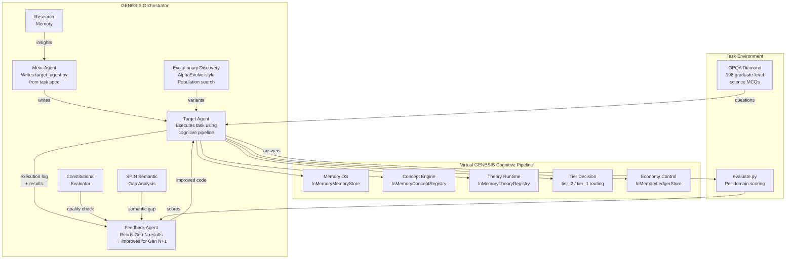

# Figure 1: GENESIS Orchestration Architecture

**Caption:** Architecture of the GENESIS orchestration framework. The Meta-Agent generates a target_agent.py script from task specifications and reference examples. The Target Agent executes the task while interfacing with a cognitive pipeline (memory, concepts, theory, tier decision, economy control). The Feedback Agent reads execution logs and evaluation results, then produces an improved agent for the next generation. The optional Evolutionary Discovery module performs population search over agent variants (inspired by AlphaEvolve/FunSearch [T5.86]). Constitutional evaluation, research memory, and SPIN semantic gap analysis provide additional quality signals. The task environment shown is GPQA Diamond — a benchmark of 198 graduate-level multiple-choice science questions across Physics (86), Chemistry (93), and Biology (19).

## Key Design Decisions

1. **Pipeline as substrate, not replacement:** The cognitive pipeline provides guidance (tier decisions, theory predictions, memory) but the LLM makes the final answer decision. This avoids the pipeline becoming a bottleneck.

2. **Multi-generation refinement:** Generation 1 is written by the meta-agent from specifications. Each subsequent generation is an improvement by the feedback agent based on actual execution results.

3. **Evolutionary diversity:** Population search with lineage tracking and diversity weighting prevents convergence to a single strategy.

4. **Constitutional constraints:** A set of rules (code quality, safety, performance) that must pass for each generation. Violations are fed to the feedback agent for correction.
