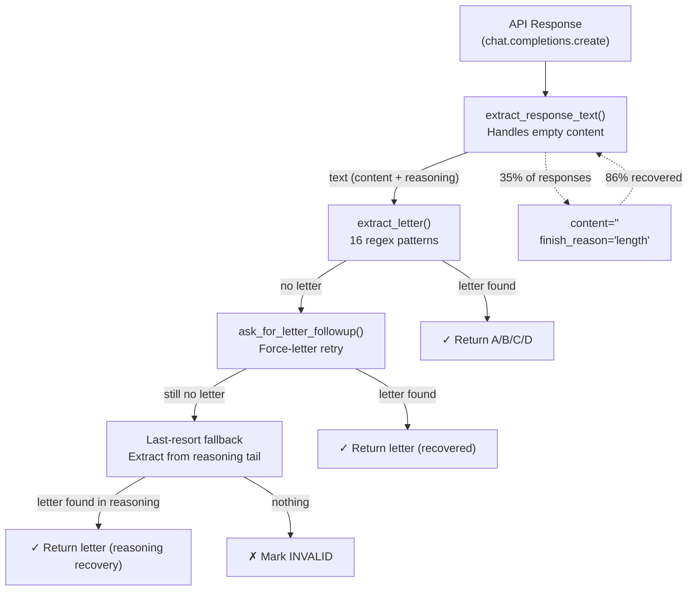

# Figure 6: Response Parsing & Recovery Pipeline

## Overview

This pipeline handles the critical challenge of extracting structured answers (A/B/C/D letters) from LLM responses, particularly from reasoning-capable models that may return empty visible content.



## Component Details

### 1. extract_response_text(resp)

**Problem Solved:** Reasoning models (gpt-oss, Nemotron, DeepSeek-R1, o-series) consume tokens in internal reasoning BEFORE producing visible content. When `max_tokens` is exhausted during reasoning, `message.content` is empty (`""`) with `finish_reason="length"`.

**Solution:** Merge visible content with internal reasoning traces:

```python
def extract_response_text(resp):
    msg = resp.choices[0].message
    content = msg.content or ""
    
    # Try string reasoning attributes
    reasoning = getattr(msg, 'reasoning', None) or getattr(msg, 'reasoning_content', None) or ""
    
    # Try structured reasoning_details list
    if not reasoning:
        rd = getattr(msg, 'reasoning_details', None)
        if rd and isinstance(rd, list):
            reasoning = "\n".join(
                item.get('text', '') if isinstance(item, dict) 
                else getattr(item, 'text', '') for item in rd
            )
    
    return (content + "\n[REASONING]\n" + reasoning) if (content and reasoning) else (content or reasoning)
```

### 2. extract_letter(text) — 16 patterns

| Category | Patterns | Example Matches |
|----------|----------|-----------------|
| **Explicit ANSWER** | `ANSWER: X`, `ANSWER:X`, `ANSWER : X`, `ANSWER IS X` | "ANSWER: A", "ANSWER:B" |
| **Alternative declarations** | `FINAL ANSWER: X`, `THE ANSWER IS X`, `CORRECT ANSWER IS X` | "The answer is C" |
| **Markdown** | `**X**` | "Therefore **B** is correct" |
| **LaTeX** | `\boxed{X}`, `\textbf{X}` | "\boxed{D}" |
| **End-of-line** | `(X)`, `X.`, standalone `X` | "...so the answer is (A)." |
| **Fallback** | Last `\b[ABCD]\b` in last 200 chars | Any trailing letter mention |

### 3. ask_for_letter_followup() — Force-Letter Retry

**When triggered:** Round 1 produced text but no extractable letter (or empty content with reasoning).

**Strategy:** Send the model its OWN previous response + a STOP THINKING instruction:

```
STOP THINKING. Just output one line with your best guess:
ANSWER: X
where X is one of A, B, C, or D. Output ONLY that single line —
no reasoning, no explanation, nothing else.
```

**Key parameters:**
- `max_tokens=256` (small — just needs one line)
- `reasoning.effort=low` (disable heavy thinking to force quick answer)
- Preserves original messages + assistant content (model sees its own chain-of-thought)

### 4. Last-Resort Fallback

If even the follow-up fails, scan the last 2,000 characters of the reasoning trace for the final `\b[ABCD]\b` — the model's last attempted answer before running out of tokens.

## Performance Impact (Measured)

| Component | Before | After | Δ |
|-----------|--------|-------|---|
| Valid extraction rate | 65% (smoke v1) | **100%** (final baseline) | +35% |
| Invalid responses (20 questions) | 7/20 | **0/20** | −100% |
| Empty content recovery | 0% (no fallback) | **86%** (6/7 recovered) | +86% |
| Lost answers per 20 questions | ~7 | **0** | Saved 5-7 answers |
| Estimated accuracy impact | — | **+8-10 points** | From parser alone |

## Design Principle: General, Not Task-Specific

This pipeline is **completely task-agnostic**:
- Works for any MCQ benchmark (GPQA, MMLU, ARC, etc.)
- Works for any reasoning model (gpt-oss, Nemotron, o-series, DeepSeek-R1)
- No hardcoded question formats, column names, or domain knowledge
- Same code handles Physics, Chemistry, and Biology questions identically
