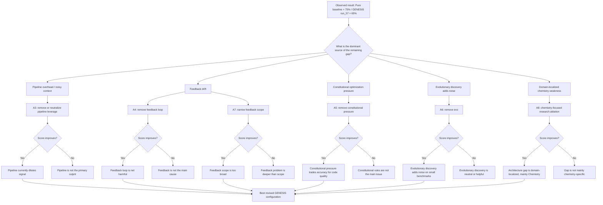

# Figure 10: Ablation Decision Tree — How We Explain the Remaining 10-Point Gap

## Reading the figure

This tree encodes the next research phase:

- We already answered the question **"Was the old 30.3% result just broken scaffolding?"** → **Yes**.
- The new question is **"Where does the remaining −10.0 architecture gap come from?"**
- Each branch corresponds to a controlled ablation from `Table 13`.

## Key principle

We do **not** redesign the whole system at once.
We isolate one suspected source of loss at a time, then update the best known architecture only after a controlled score improvement.

That keeps the project scientific instead of drifting into uncontrolled product-style iteration.
